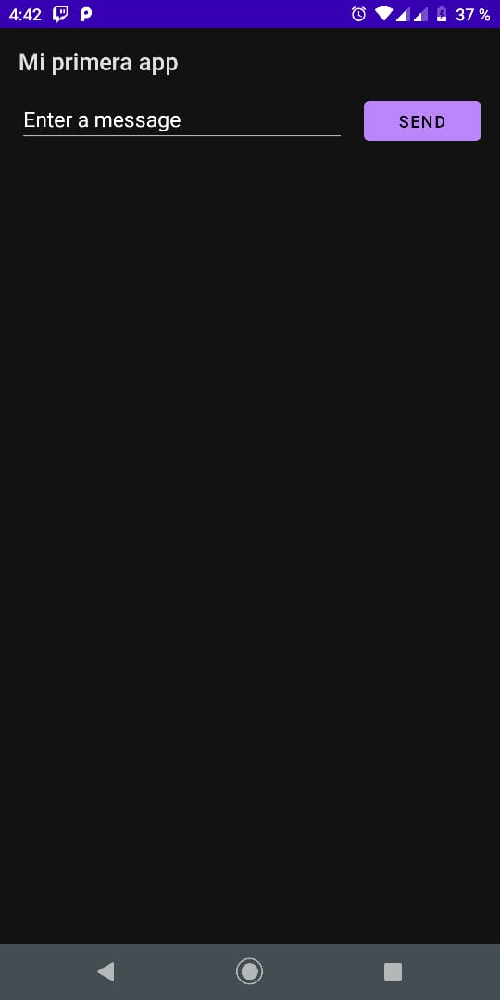

# IETI-Laboratorio-11
### Escuela Colombiana de Ingeniería Julio Garavito
### Edwin Yesid Rodriguez Maldonado

## Parte 1

Crear un nuevo proyecto en Android Studio

## parte 2

### Ejecutar tu app

* Ejecutar la app en un dispositivo real

* Ejecutar la app en un emulador

## Parte 3

Crear una interfaz de usuario sencilla

Configuración del lugar de trabajo

Agregar un cuadro de texto

Agregar un boton

## Iniciar otra actividad

